Lesson 5: Interactivity and more JavaScript
===========================================

(Meta: to be deleted)

I won't be covering too much detail about jquery - I'd rather send people over to the jQuery tutorials, which is quite accessible and comprehensive. I'll introduce the key features of JavaScript they should be aware of (most importantly functions in variables), talk about the basic concept of selecting an element an doing something with it (and introducing new tags/ids/classes to help select something better), how to work with the console and develop iteratively by testing commands interactively and building functions out of them, what events are in general, and issues with document.ready etc that stump a lot of newcomers. Then I'll give a quick demo of how to do HTTP requests in the background, which will require a small recap of HTTP requests. I'll also show the chrome network monitor and debugger, just so that they know these exist and are useful.

Overview:
-  10-15 minute overview of Javascript syntax
-  15 minute of developing a small functionality on the spot, with tips on using the chrome console and some very basic debugging features
-  10-15 minutes of going over HTTP again, and familiarizing them with the idea that you can send JSON instead of HTML which is easier to work with when you want to communicate data. Show uses of Chrome network monitor, and testing an API with POSTMAN. Give them a modified version of the flask app from lesson 3 that handles JSON.
-  String together two ajax calls to show how you can communicate with the server and update the page without reloading.


I'm concerned that the tutorial is too long. I might have to cut back on some of the things I described here if I run out of time. 

(EndMeta)


Hello everyone, we will start off with a quick review of javascript, please check _jssyntax.md_.

Hopefully now that we're more comfortable with the JavaScript syntax, let's see how we can change contents of the page using JavaScript. 

We will be using a very popular JavaScript library called jQuery, which gives us two advantages: it has a very clean and uniform interface, and it masks all the complications of browser compatibility. 

Let's begin with adding jQuery to our code. 
Please open jsdemo.html, and add the following like to the `head` section.
```html
<script src="https://code.jquery.com/jquery-2.1.1.min.js"></script>
```
(The most updated url for jquery code can be found in https://code.jquery.com/)

Save and open the page in a browser. You can test if jQuery is properly loaded by opening a console and entering `$`. If you see the following:
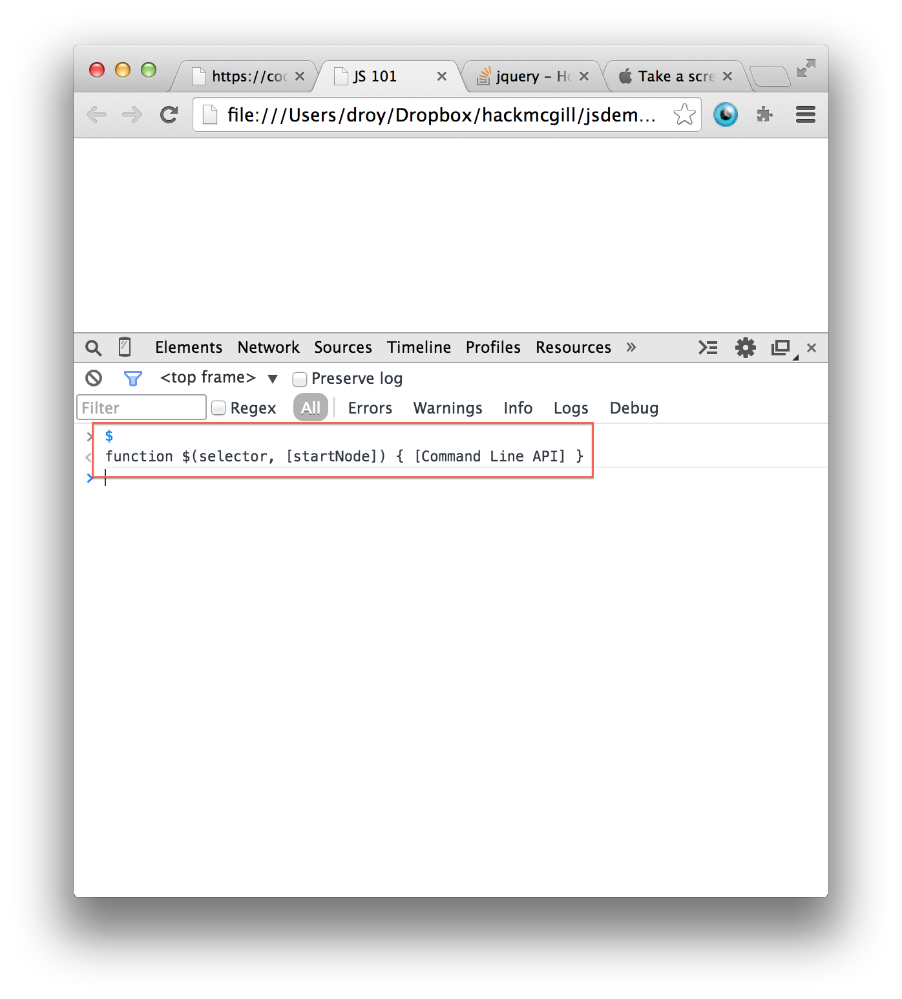
then jQuery is not loaded properly - check if there are any red errors on the console, and if you saved the file after adding the line, and if you're opening the right file in the browser.

If everything goes on okay, you will see the following:
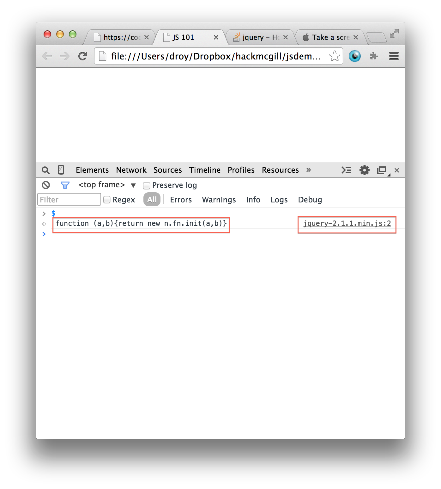

There is nothing magical about `$`: It is just a regular variable. It holds the massive jQuery object as its value, and all the jQuery functions are accessible through this object. In fact, we could assign the value of `$` to some other variable (say `jq`), and obtain all the jQuery functions through that variable. 
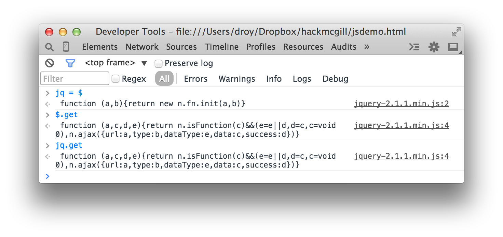
Since JavaScript does not offer namespacing by default, if all the jQuery functions were available in the global namespace, you would very possibly sooner or later accidentally call a jQuery function without knowing. But since all the functions are now inside `$`, we have to write `$.get` instead of just `get`. This forces us to be aware that we're using a jQuery function, and thus reduces the chances of bugs.

In tutorial 3, we made a comment box for the site. In `jsdemo.html`, we've set up a similar comment box:
```html
<form action="/submit_message" method="post">
  <textarea placeholder="Enter your message here" id="inputText" name="message" cols="50" rows="4"></textarea>
  <input type="submit" value="Submit">
</form>
```

Let's say we want to count the number of characters in the textbox. We could, of course, click submit, and look at the text content on the server, count the characters, and send back a rerendered page with the number of characters, but that's clunky and requires reloading the page everytime. We want to do this live.

First order of business: Let's add another div on top.
```html
<div class="charCountDiv">Number of characters: 0</div>
```

This is what the page looks like at this point, and the character count is _not_ live-updating. 

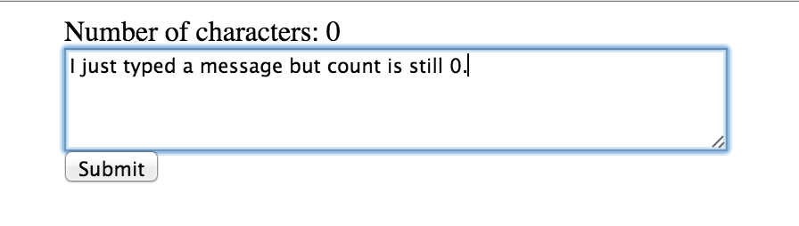

Note that if we could somehow extract whatever text is in that textbox as a string, we could just use `string.length` to count the number of characters in it. To get text from that textbox, our intuition tells us that we first have to somehow "select" it, or get our hands on a object that represents the textbox in the DOM.  

## jQuery selectors
Luckily for us, jQuery makes selecting anything on the page super simple: It uses the CSS selectors. Note that the text box has id `inputText`. If we wanted to write CSS rules to style it, we would write something like this:
```css
#inputText {
    color: blue;
    /* some other css styles*/
}
```

Similarly, to get the textContent as a jQuery object, we do this: 
```javascript
var textbox = $("#inputText");
```

How do we know that our selection worked? Type that into the console, and then just enter textbox in the console to see its value. When you hover over the value, the associated element on the page with become highlighed. If everything goes all right, you should see something like this: 

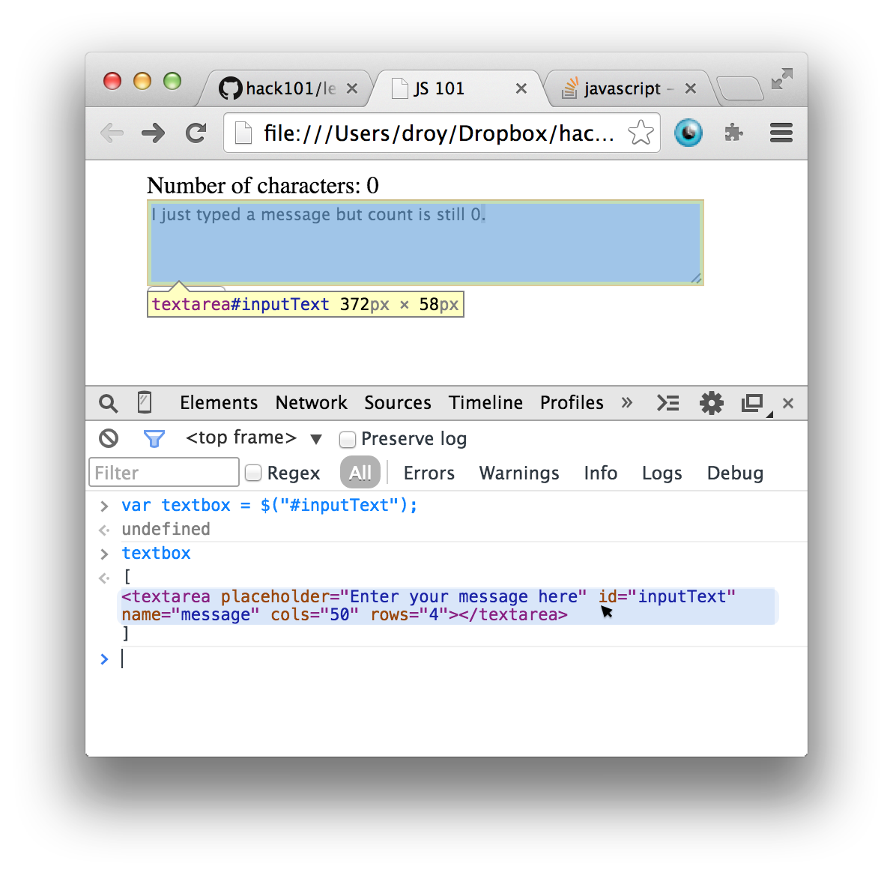

Let's see if we can get the text in the textbox as a string. A quick google search reveals lots of helpful stackoverflow answers, and we learn that we can get the contents of a textbox using the `val` function of jQuery. How do I test if it works? 
```javascript
textbox.val()
// "I just typed a message but count is still 0."
```

Fantastic! Counting a number of characters now is a trivial exercise:
```javascript
var text_value = textbox.val();
text_value.length
// 44
```

Okay, so we're confident we can use JavaScript to count the number of characters in the box. Now we need to update the count. Let's first try to change the value 0 to any number, say the ever-clichéd 42. In order to do that, again we need to first make sure we *_select_* the right element. How do we just select the number 0? The way it is now, 0 is a bit hard to select. You can use `$(".charcountdiv")`, but then you end up selecting the whole div: 

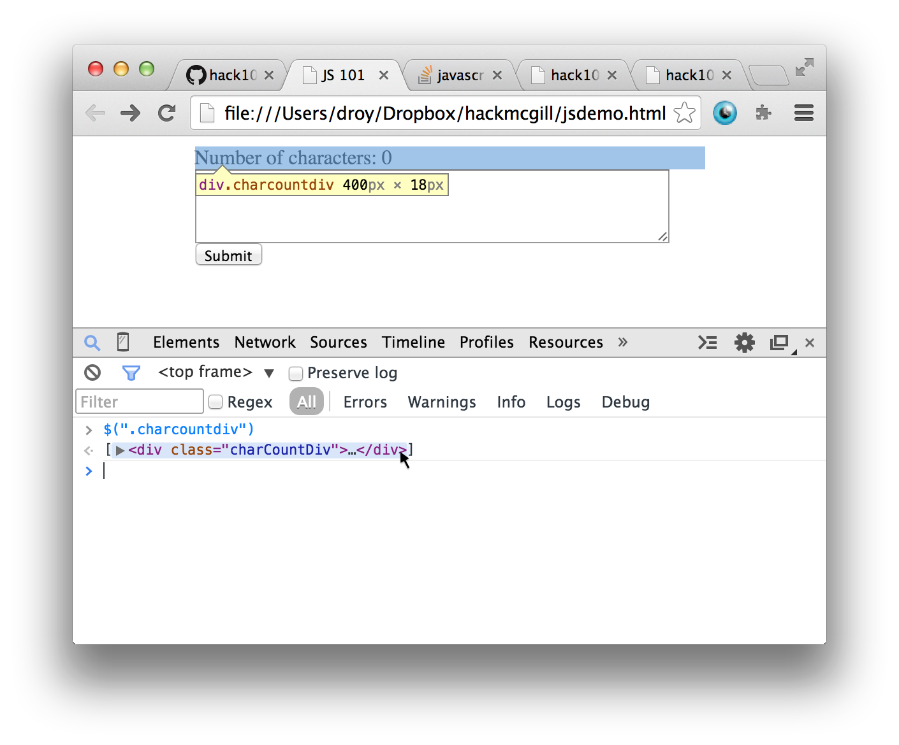

We can certainly update the whole div at a time, but we want to make our lives easier and just update the number 0. How do you "grab" that 0? One way to do it is to enclose the 0 in a span tag with some id. Let's change the charCountDiv line in our html file to this:
```html
<div class="charCountDiv">Number of characters: <span id="charCount">0</span></div>
```

Now we get more specific selection with `$("charCount")`:
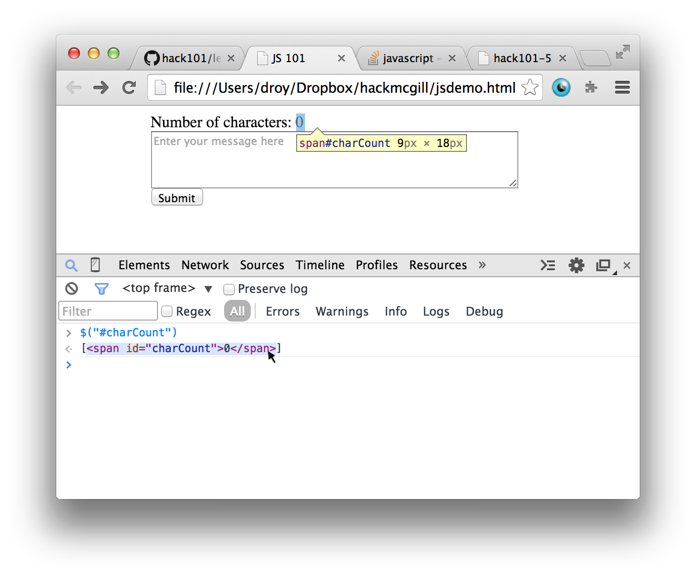

A Google search (and maybe a glance at jQuery's docs) reveal that we can change the textContent of any DOM element using jQuery's `text` method. Let's try that:
```javascript
var countElement = $("#charCount");
countElement.text(42);
// It works!
```
Hooray! We're close to our goal. Can we make a function `updateCount` that  up glues the two things together?
```javascript
var updateCount = function() {
    var textbox = $("#inputText");
    var text_value = textbox.val();
    var text_length = text_value.length;
    var countElement = $("#charCount");
    countElement.text(text_length);
};
```
Now type something in the textbox, and call updateCount from the console, and see the value magically changing. Now that's still not exactly what we want: we want to update the count every time the value of this textbox changes. Since we have a handy `updateCount` function now, we just need to change call `updateCount` everytime the value of the textbox changes. But how do we detect such a change? 

## Events
There are lots of different things happening in the DOM all the time, and many of these different things are formalized into a notion called *events*. Your mouse moving on the page is an event, you clicking something is an event, and of course, the value of a textbox changing is an event. We can _register_ these things called _event_handlers_ to an event, and when an event happens (or in more widely used terms, an event *_fires_*), all the event_handlers gets called. The handlers are usually also given specific data about the event. For example, if you register an event_handler for the mouse-move event, the event_handler will possibly get called with the coordinated of the mouse pointer as an argument. In our very simple example, we won't be needing such data.  

But what _are_ event handlers? How do you define one? In JavaScript, since we can merrily store a function in a variable, event_handlers are just functions! So our updateCount function method we defined above could be an event handler!
Let us go ahead and register this event. 

Events are associated with a particular DOM element, and with lots and lots of google search, we determine that the event we are looking for is the "input" event on the textbox. Here's how we register the event:
```javascript
var textbox = $("#inputText");  // Selecting the correct element
textbox.on("input", updateCount);
```
Notice how we casually passed in a function as the argument of another function. Now every time the "input" event is raised/fired on the textbox, the updateCount function will be executed. Now we type some text into the textbox, and lo and behold, the count updates live!

## Putting it into a script, and document.ready

Now that we're confident our code works, it's time to put it into a file and load it with the html document. We put the following code into `livecount.js`:

```javascript
var updateCount = function() {
    var textbox = $("#inputText");
    var text_value = textbox.val();
    var text_length = text_value.length;
    var countElement = $("#charCount");
    countElement.text(text_length);
};

var textbox = $("#inputText");  // Selecting the correct element
textbox.on("input", updateCount);
```

And then add a script element in the head section to load it in.
```html
<head>
    <title>JS 101</title>
    <script src="livecount.js"></script>
    <script src="https://code.jquery.com/jquery-2.1.1.min.js"></script>
    <link rel="stylesheet" href="jsdemo-styles.css">
</head>
```

We reload the page and expect everything to work, but to our surprise, when we reload the page the livecount functionality does not work!

Before you pull your hair out, the first thing to do to debug things situations like this is to open the console and look for errors. We find this gem in the console:
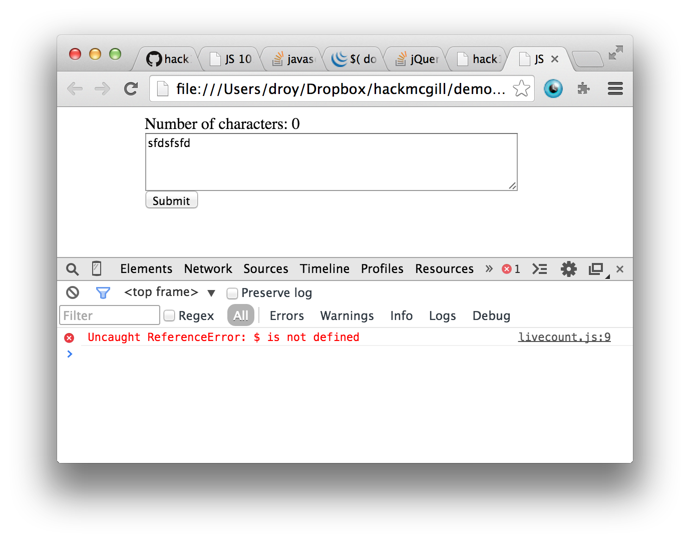

We click the red line number reference, and then hover our mouse over the red cross symbol, and see this message:
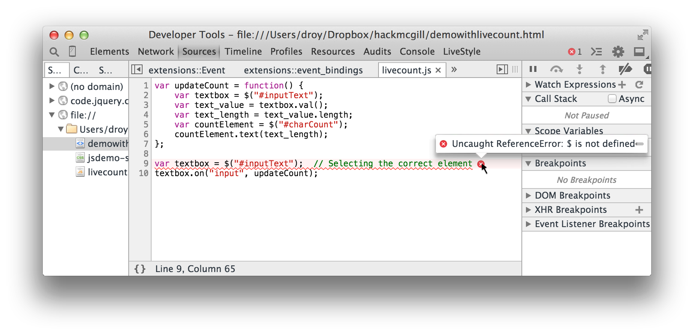

Ah, so `$` is not defined. `$` is the variable that holds the jQuery objects, so that means jQuery is not defined. But don't we have jQuery loaded already? We look at the head section again to see what the problem is, and it turns out we're loading `livecount.js` _before_ we're loading jQuery. So when livecount tries to access jQuery functions, it can't find them. When you code in Java, you never have to worry about import order, but here the order in which the scripts are being loaded is quite important.

So we fix the head section:
```html
<head>
    <title>JS 101</title>
    <script src="https://code.jquery.com/jquery-2.1.1.min.js"></script>
    <script src="livecount.js"></script>
    <link rel="stylesheet" href="jsdemo-styles.css">
</head>
```

But it's STILL not working! Worse, the console doesn't also have any error message this time, so you don't even know how to start looking for errors. The thing to do at this point is to search for similar problems on Google, and maybe skim through some jQuery and JavaScript tutorials to see if someone mentions anything like this. If all else fails, ask for help on StackOverflow, or if you're scared to post there, ask on the Hack101 discussion board!

The thing we're doing wrong here is that the script livecount.js is loaded and executed in the head tag. The browser hasn't even taken a look at the body section yet, and therefore the DOM does not yet contain any element with id "inputText". In the line `var textbox = $("#inputText");`, `textbox` therefore becomes an empty element, and our event_handlers do not get attached properly.

There are two ways to fix this: Either we can move the script tag for _livecount.js_ all the way to the last line of `body`, so that we load it only when the required elements have been built. Another approach (which feels more aesthetically pleasing to me) is to use document.ready:

When a complete HTML document finishes loading, and the browser is done building the DOM tree, it fires an event named `ready` on the `document` object. Thus if we execute a function after `ready` event is fired, we're guaranteed that all the elements have already been properly loaded.

We make the following changes to livecount.js:

```javascript
// Create a new function
var livecount = function() {
    // Everything in old livecount.js
    var updateCount = function() {
        var textbox = $("#inputText");
        var text_value = textbox.val();
        var text_length = text_value.length;
        var countElement = $("#charCount");
        countElement.text(text_length);
    };

    var textbox = $("#inputText");  // Selecting the correct element
    textbox.on("input", updateCount);
};

// Register the new function to the ready event of document 
$(document).on("ready", livecount);
```

We reload the page, and rejoice, everything is working!   

## Other jQuery things
In this example, we changed the text value of an element, but using jQuery you can pretty much make any modification to the page you can imagine. You can add/remove classes to elements, modify ids of elements, change css properties, and dynamically add/remove nodes from the DOM tree. You can even have cool animating transitions. I could give you a laundry list of all the jQuery functions and objects, but you're much better off heading over to http://learn.jquery.com/, where they have excellent tutorials on how to do all of these things.

## Keeping in touch with the server
For the remainder of this tutorial, I will focus on another very important aspect of modern web development: communication between the web browser and the server without reloading the page. This is often referred to as *Ajax*.

This is a good opportunity to recap the basics of HTTP, since you must understand HTTP clearly to properly understand how to program such a website. HTTP is a request-response protocol: There are things called "clients" that sends requests, and there are things called servers that "serves" these requests with a response. The protocol is the foundation of the the World Wide Web, which kind of means it's the foundation of the Internet, which kind of means it's the foundation of all things you love and hold dear. The most familiar HTTP client is your own web browser. A server is whatever program answers these requests: we built one in Lesson 3 when we talked about backend programming.

(Meta: This section should be refactored to include more demo with network monitor and less/no talking about requests/responses in plaintext. Also need to talk about request payload for POST requests, since we use it later.)

This is conceptually what a request looks like: 
```
host: www.wireshark.org
method: GET
# other-fields we don't really care about at the moment
```
**host**: The address where you're sending the requests. Gets resolved to an IP address eventually by DNS servers.
**method**: These are also known as HTTP _verbs_. Can be one of GET, POST, DELETE, PUT, PATCH, OPTIONS, HEAD etc, and more or less defines a *type* for the request. New verbs must be defined in an RFC by standardization organizations - you cannot make up your own HTTP verb.

Requests can sometime contain more data. For example, if you fill out a form and click submit, the browser packs all the information you entered at the end of the request. This data is often known as **request payload**. Here is an example:

```
host: http://api


So this request gets pushed from router to router until it finally arrives at whichever server is serving www.wireshark.org. The server looks at the request, thinks for a bit, and sends back an appropriate response. Here is what a response looks like:

```
status: 200 OK
content-type: text/html
# Lots of other headers 

<html>
    <!-- lots of html here -->
</html>
```
```

**Content-type** What type of content it is. Compare with the accept header field in request. Can be one of "text/html", "application/json", "application/xml" etc. See http://en.wikipedia.org/wiki/Internet_media_type#Type_image for a big list of standardized types.
**Status Code**: The general status of the request, so that clients can get a hint of what happened even without looking at the returned content. Many status codes are defined; you can find a big list of them here: http://en.wikipedia.org/wiki/List_of_HTTP_status_codes 

In general, any 2xx code means some form of success (e.g. 200 OK, 201 Created, 202 Accepted), 3xx codes mean Redirection (e.g. 301 Moved Permanently, 302 Found), 4xx codes mean Client error (i.e. you sent a stupid request and the server hates you), (e.g. 403 Forbidden, 404 Not Found, and 418 [I'm a teapot](http://en.wikipedia.org/wiki/Hyper_Text_Coffee_Pot_Control_Protocol)), 5xx means server error (i.e. completely legitimate request, but the server screwed up at some point trying to serve it) (e.g. 500 Internal Server Error, 503 Service Unavailable).

(endMeta)

When you load the jsdemo.html page, do you know how many HTTP requests the browser makes? It is worth looking through the HTML code and thinking about it for a bit. How would you find out for sure? Chrome has a very handy network monitor that lets you see exactly what requests the browser is making. Open the developer tools, and navigate to the Network tab. Now reload the page. You should see at least four requests being made:

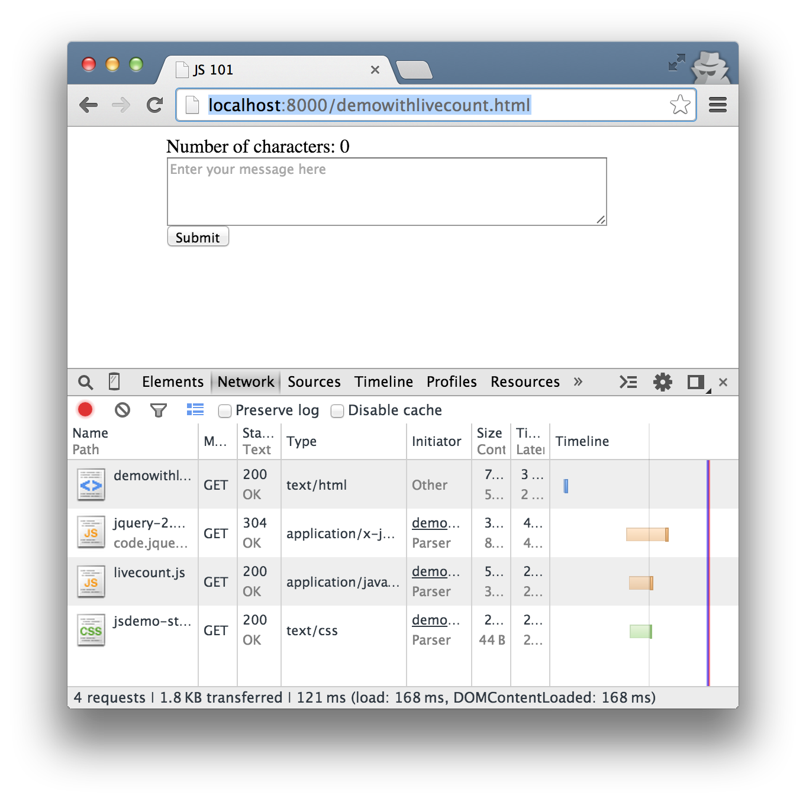

If you see a lot more requests, it might be because you're using some chrome extension that are making network requests. You can try opening incognito mode (where all extensions are usually turned off) and retry the experiment. 

Notice how the network monitor clearly tells us where each request was made, the request method (or HTTP verb), and the status code of the response. You can click on each of those to get a more detailed description of them.

If you didn't attend the tutorial, I leave it to you as an exercise to explain why the requests are made in that particular order. 

But so far the requests are not really under your control - the browser automatically decides how to send these requests. Wouldn't it be cool if you could send a custom HTTP request and see the raw response? Enter Postman.

## POSTMAN

POSTMAN is a chrome extension that lets you do exactly that! You can install it from [here](https://chrome.google.com/webstore/detail/postman-rest-client/fdmmgilgnpjigdojojpjoooidkmcomcm?hl=en).

Just to get a feel of how to use it, try making a GET request to github.com. You'll get a massive response back with lines and lines of html:

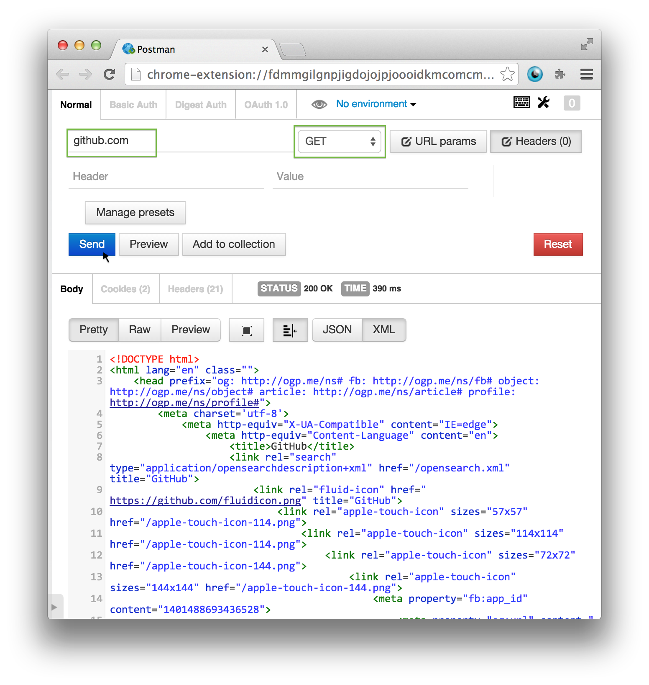

If we want to just communicate _data_ instead of requiring a complete html page, it is often preferable to use a lighter data format. Most modern web applications use a format called JSON (which stands for JavaScript Object Notation) to encode data. To see an example of a JSON response, we send a request to `api.github.com`. 


Note that there the object returned is exactly the notation we used to define objects in JavaScript!

## Our own JSON-enabled server

The flask-package directory in the git repo has the code of an app that consumes and serves JSON. I'll develop a feature on top of it live and you may not have time to implement these features on your computer right now, but after the tutorial you're strongly suggested to develop the same features yourself. If you encounter any difficulties, post in Hack 101 hackers :)

The server serves index.html, which is the same jsdemo.html page with an additional name input field.

The server also defines an endpoint at `/messages`, which has the interesting property that it accepts both `GET` and `POST` request, and exhibits different behaviour depending on what the request type is: 
```python
message_list = []

# This url handles both GET and POST, with different functionality
@app.route('/messages', methods=['GET', 'POST'])
def messages():
    if request.method == 'GET':
        return json.dumps(message_list)  # Convert message_list to a json string
    if request.method == 'POST':
        # request.data contains the json data from client
        msg = json.loads(request.data)  # Convert the json string to a python dict
        message_list.append(msg)
        return json.dumps({"status_message": "ok-created"})  # Return something
```

If you're confused about `json.dumps` and `json.loads`, I suggest you look up the python docs and then play around with the two functions in a python interpreter.

## Testing the server with POSTMAN
Run the server with the usual `python app.py`. If you're having troubles, check if flask is installed. You can refer back to lesson 3 for help, or just ask on the Hack101 facebook group. Try going to http://localhost:5000 and see if the server is working.

We test our new JSON API (Yay we can actually call it an API now :)) using POSTMAN. First we try to post a new message. Let's say our messages will always have the form:
```javascript
{
    "name": "some_name",
    "message": "some_message"
}
```

Say we send the following message as a POST request.
```javascript
{
    "name": "Spooky",
    "message": "booooooo booooooo"
}
```

With POSTMAN, you can issue the request like these: (Notice the boxes in green)
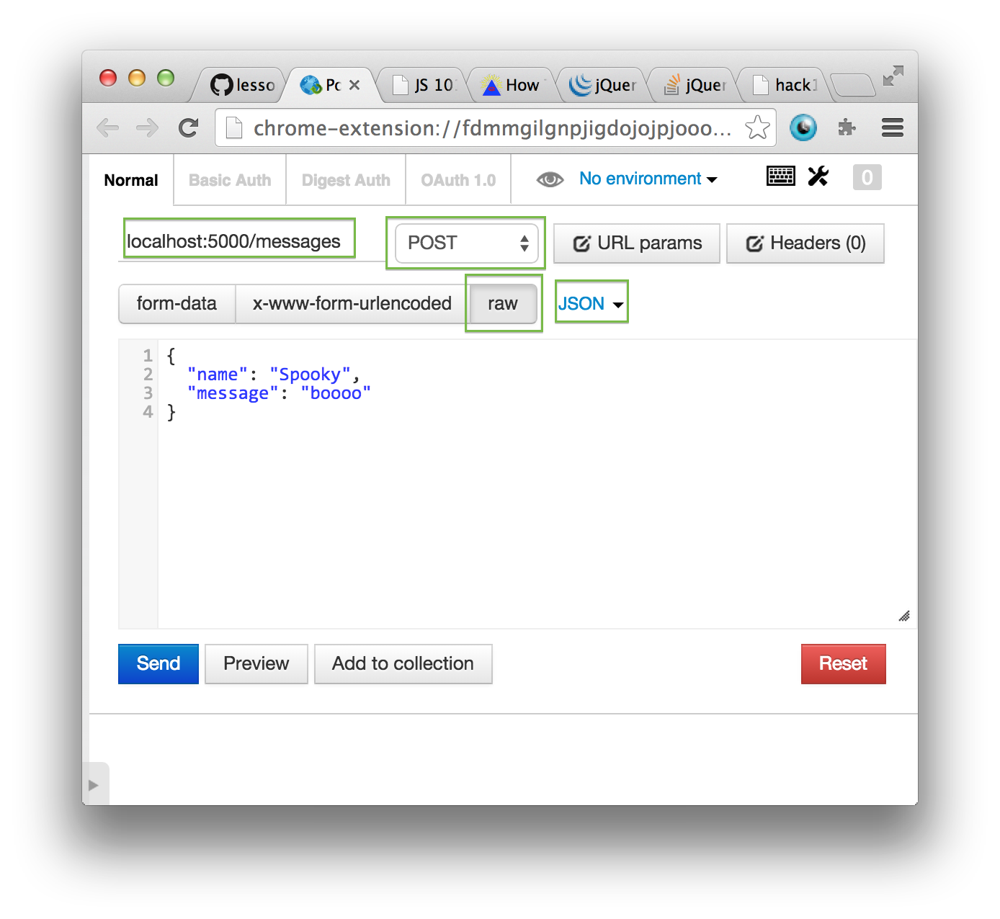

If you switch the request type to `GET`, you now get back the following response:

    [{"message": "boooo", "name": "Spooky"}]

You can try POSTing a few more messages and check they all gets returned with the GET request. At this point, we're reasonably confident that our server is working the way we want, and we can move on.

## POSTing without reloading

Okay now we want to post the data to the server from the form, but we want to do this without reloading the page. We navigate to http://localhost:5000 to get back to the root page. If we use the submit button now, it will not work: First, because the default behavior of form submission is to leave the current page and load whatever response the the action method sends as a response; and second, because by default the submit forms send the data as a POST-encoded string, not a json string. Our server is now used to expecting a clean json string as request payload.

This is where we first use the issue HTTP requests through jQuery. Our swiss army knife for all http communication will be the `$.ajax` function. We create a new javascript file called `liveupdate.js`. The functions we are going to write now will be too big and complicated to test on the console directly, so we will wrap our code in a function called test for now, and call that function from the console.
```javascript
var test = function() {
    console.log("Test function executed");
};
```

In the console:
```javascript
test()
// Test function executed
```

Now that we have our testing loop set up, we focus on the jQuery function to send http requests. Our swiss army knife here is [$.ajax](http://api.jquery.com/jquery.ajax/). To send a `POST` request with it, we do the following:
```javascript
var test = function() {
    $.ajax({
        // Where to send the request
        // Determines what goes into the "host" header of the request
        // It's important to include the full url, including "http://"
        url: "http://localhost:5000/messages",

        // Note that this is the string. This is the request payload
        data: '{"name": "Alice", "message": "hey"}',  

        // The http verb
        type: "POST",

        // Indicating we're sending json (as opposed to form encoded data or xml)
        contentType: "application/json",
        
        // A callback function to be executed upon success
        // It's passed in the returned data as the first argument
        success: function(data) {
            console.log("Successful POST request :)")
        }  // A function that gets executed upon seccessful request
    });
};
```

Now reload the page, and execute `test` on the console.
```javascript
test()
// Successful POST request :)
```

Sure enough, if we head over the network tab, we see a new request with response status 200:

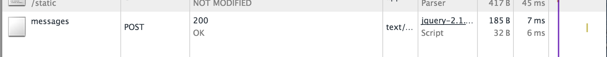

Another test that this worked is to send a GET request to http://localhost:5000/messages to get all the messages, and see if the new message shows up there.

## JSON as string

Okay, so we cheated a bit up there - We handcrafted a JSON string instead of getting it from the forms. We now write some code that will create a JavaScript object from the values in the two text boxes: 

```javascript
var msg_obj = {
                name: $("#inputName").val(),
                message: $("#inputText").val()
          };

console.log(msg_obj);
// prints out the pretty object
```

Next we use the a handy function called JSON.stringify to turn it into a string. (How did we know JSON.stringify exists? I googled "javascript convert json to string").
```javascript
var msg_obj_str = JSON.stringify(msg_obj); 
console.log(msg_obj_str);
// prints out the object as just string
```

Okay so now that we know how to construct the data to send with our post request, we compile them together in the test function:

```javascript
var test = function() {
    var msg_obj = {
                name: $("#inputName").val(),
                message: $("#inputText").val()
          };
    var msg_obj_str = JSON.stringify(msg_obj); 
    $.ajax({
        url: "http://localhost:5000/messages",
        data: msg_obj_str,
        type: "POST",
        contentType: "application/json",
        success: function() {
            console.log("Successful POST request :)")
        }
    });
};
```

Pop quiz: How would you test that your this code is actually taking the right values from the two input boxes and sending them to the server?

## Preventing default submit behavior

Okay so we're at the stage where we can type in our name and message, and execute `test` from the console, and send the post request. This fulfills our goal of sending a `POST` request without reloading page, but we would very much like to do this by just clicking the submit button, instead of fiddling around with the console. 

We take a wild guess that the form probably has a _submit_ event associated with it, that gets triggered when the submit button is clicked. To test the hypothesis, from a console we bind a very simple function that just does `alert(1)` to the submit event of the form, and see if this works:
```javascript
$("#messageForm").on("submit", function(){ alert(1);})
```

We then click the submit bound, and guess what, this works! Just before we leave the page, we get this alert box:

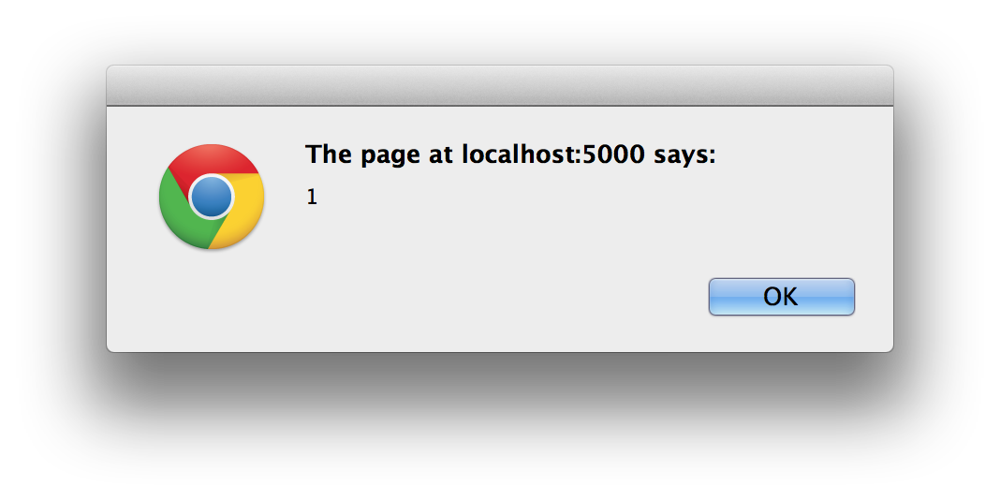

(Pop quiz: Why did we use alert(1) inside the anonymous function? Why not somethinng like `console.log("This works!")`?)

Beautiful. We now see if we pass in the function `test` that we have been always executing, instead on the stupid anonymous function we defined above.

```javascript
$("#messageForm").on("submit", function(){ alert(1);})
```

We fill in `debug42` for _name_ and `debug424242` for _message_, click submit, and oops, it doesn't look like it's working. But we want to check if any request made it to the server anyway, so we check the messages on the server (of course, by sending a `GET` to http://localhost:5000/messages). To our surprise, our message made it through! We see `debug424242` as the last message.

Now what is happening here? Our function gets executed all right, but **it does not override the default behavior of submit**, which is to go to another page and sending the HTTP request. How do we prevent the default behavior? What I never mentioned is that every callback function registered to an event gets called with an *argument*, which is an object representing the event. If you're a Java/Python/C/C++ coder, all sorts of alarm bells should be going off - I'm saying the callback function is called with an argument (like `function(arg1)`), but our function never accepted an argument (it is defined like `function() {...}`. Shouldn't this throw fatal errors? Curiously enough, as we may have mentioned in the js syntax review, passing in more arguments than your function accepts is not an error in JavaScript - your function will just not have access to those arguments.

Okay but now finally we _do_ need access to the first argument which will be the event, and jQuery provides a method named `preventDefault` that stops the regular behavior of an event. So we rewrite the function `test`: We rename it to a better name (`sendMessage`), we take event `e` as an argument, and the first thing we do is call `preventDefault` on the event.

```javascript
var sendMessage = function(e) {  // e stands for event
    // BEWARE: calling the argument 'event' does not work in Chrome
    // There are all kinds of weird conventions across browsers
    // regarding the variable "event"
    // Welcome to the funland of JavaScript
    e.preventDefault();
    var msg_obj = {
                name: $("#inputName").val(),
                message: $("#inputText").val()
          };
    var msg_obj_str = JSON.stringify(msg_obj); 
    $.ajax({
        url: "http://localhost:5000/messages",
        data: msg_obj_str,
        type: "POST",
        contentType: "application/json",
        success: function() {
            console.log("Successful POST request :)")
        }
    });
};
```

We try out this on the console:
```javascript
$("#messageForm").on("submit", sendMessage})
```

and everything works beautifully - submit button no longer refreshes your page.

Just as before, we wrap everything in document.ready so that we get this behavior from the beginning. We recreate a new function called test, which we will use the develop the last feature. liveupdate.js now looks like this: 
```javascript
var liveupdate = function() {
    var sendMessage = function(e) {
        e.preventDefault();
        var msg_obj = {
                    name: $("#inputName").val(),
                    message: $("#inputText").val()
              };
        var msg_obj_str = JSON.stringify(msg_obj); 

        $.ajax({
            url: "http://localhost:5000/messages",
            data: msg_obj_str,
            type: "POST",
            contentType: "application/json",
            success: function() {
                console.log("Successful POST request :)")
            }
        });
    };

    $("#messageForm").on("submit", sendMessage);
}

$(document).on("ready", liveupdate);

var test = function() {
    console.log("Test funciton is back!")
}
```

## Appending children
Phew. The last feature we want to develop is add the messages to the bottom of the input box, and automatically update the list. Let's first see how we can append a item. 

In index.html, just below the form, we add a new div:
```html
<div class="messageWall"><div>
```

This div will hold contain all our messages. We fiddle around a bit with the code, find that we can live with the following style:

```html
<div class="messageWall">
  <div>Bob: Hello there!</div>
  <hr />
  <div>Alice: Oh hey!</div>
  <hr />
</div>
```

It produces something like this:
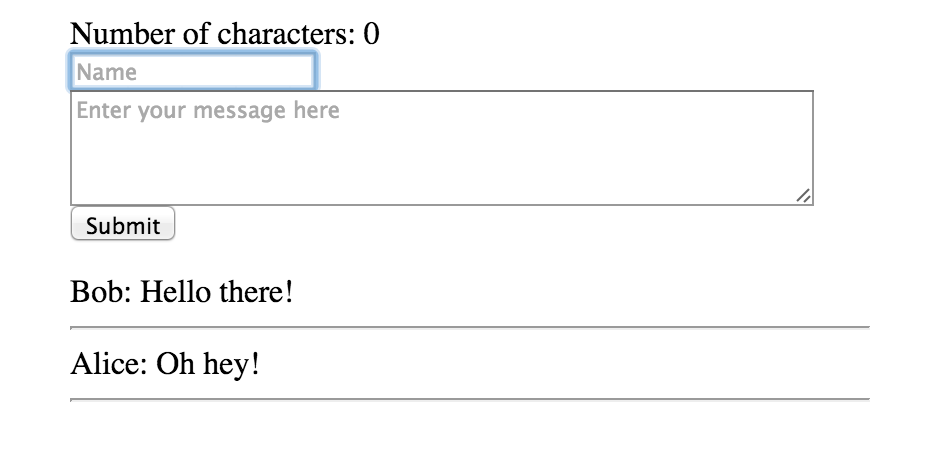

So we see say for each message we get back from the server, we have to create the following block `<div>some_name: some message </div><hr />` and append it as a child of `div.messageWall`. Creating an arbitrary html fragment in jQuery is as easy as `$("<html code>")`. So we go ahead and try out the following in the console: 
```javascript
var html_frag = $("<div>Natalie: Yo!</div><hr /");
$(".messageWall").append(html_frag);
```

And voila, we get the following:

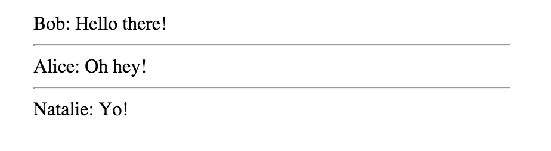

## The GET request

Feeling super confident, we go ahead and write the following block of code in the `test` funciton of liveupdate.js:
```javascript
var test = function() {
    var appendMessage = function(msg) {
        var html_string = "<div>" + msg.name  + ": " + msg.message + "</div><hr />";
        var html_frag = $(html_string);
        $(".messageWall").append(html_frag);
    }

    var success_callback_get = function(data) {
        // We peeked into the documentation and saw that the success callback is called with the data object as the first argument
        
        // We first remove all the children of messageWall. We want to start fresh
        $(".messageWall").empty();

        // Our server returns a list of messages, so we just iterate through it
        for (var i=0; i < data.length; i++) {
            var msg = data[i];
            appendMessage(msg);
        }
    }

    // Now the ajax request
    $.ajax({
        url: "http://localhost:5000/messages",
        type: "GET",
        success: success_callback_get
    });
}
```

We execute `test`, and oh the horrors: 

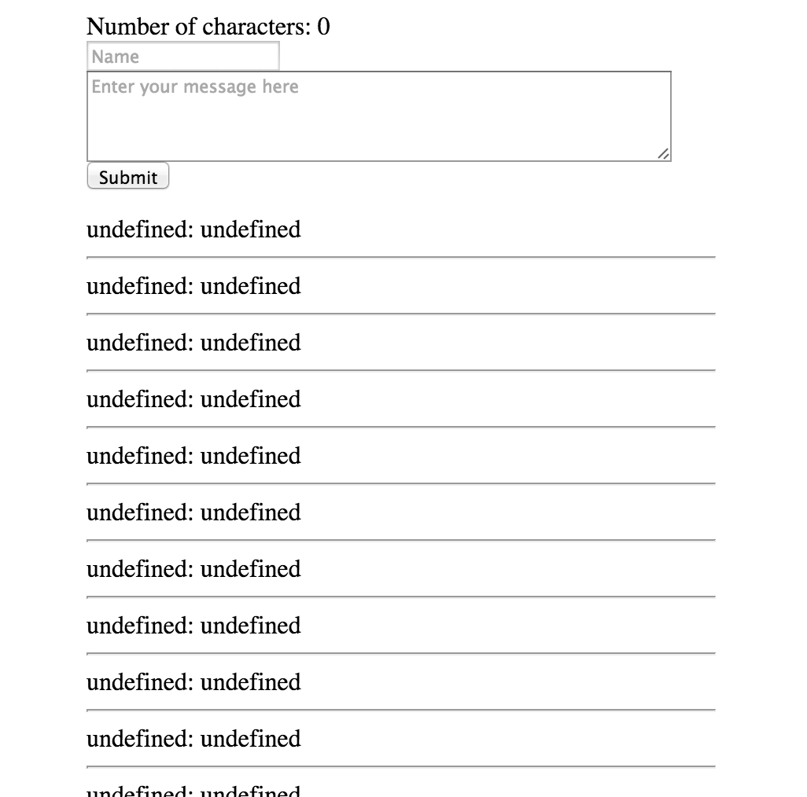

What went wrong? We can speculate all day, but at this point, I've been talking for about an hour, and I'm sure everyone is very impatient. Let's tap into the magic of debugger. We set a breakpoint inside the `appendMessage` function, and check the value of the variables:

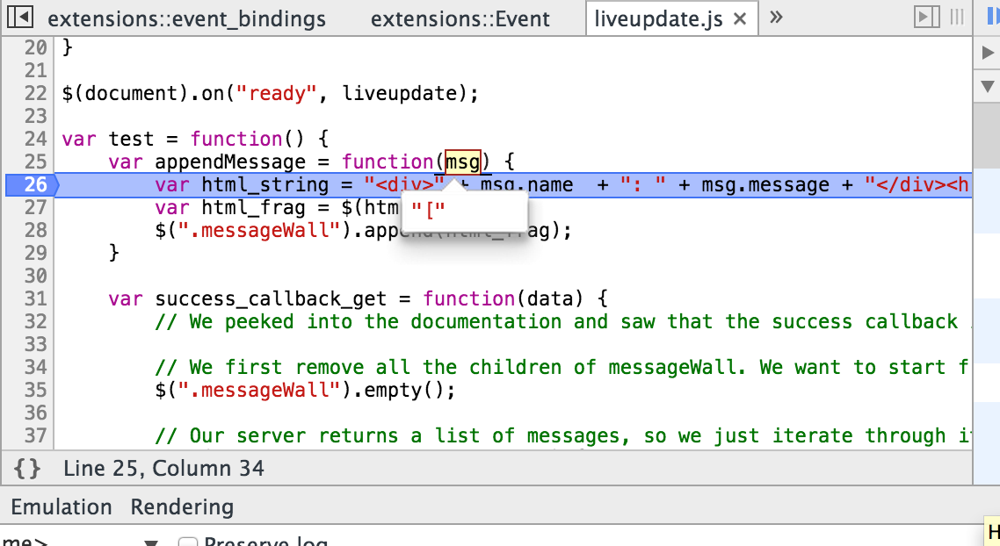

The value of msg is "["? What? Even more confused, we set a breakpoint inside the `success_callback_get` function this time, to see how we call `appendMessage`. We find that `data.length` is 625 :S

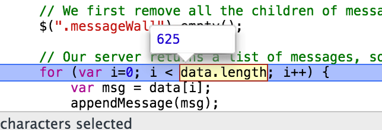

We press `ESC` to open up the console in the current console (I swear to god this feature is Godsent). I type in `data`:
```javascript
data
// prints out a massive string
```

Ah, so data is a string! jQuery did not automatically parse the JSON string returned by the server into a JavaScript array. Fortunately, this is quite easy to fix. We just use the method called `JSON.parse`, which is the exact opposite of `JSON.stringify`. The fixed `success_callback_get` looks like this:

```javascript
var success_callback_get = function(data) {
    // We first remove all the children of messageWall. We want to start fresh
    $(".messageWall").empty();
    
    // Convert data to a real javascript array 
    data = JSON.parse(data);

    // Now the usual loop 
    for (var i=0; i < data.length; i++) {
        var msg = data[i];
        appendMessage(msg);
    }
}
```

We execute test, and it works!

## Autoupdate: setInterval

If you want to execute a function periodically, JavaScript has a useful function called `setInterval(callback, milliseconds)`.

We quickly test it out on a simple function in the console to get a feel for its functionality:
```javascript
setInterval(function() {console.log("I just executed!"), 2000});
```

We notice that `"I just executed"` gets printed out on the console, and a counter to its left gets updated every 2 seconds (this is because there chrome folds exactly same outputs into one instead of printing them multiple times.)

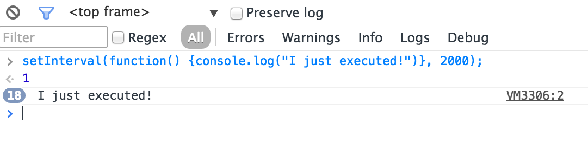

Okay so we can hook up the `test` function to this setInterval.
```javascript
setInterval(test, 2000);
```

And look at that, the page is now auto-updating every two seconds! No reload. Such interactivity! Much real-time!

To wrap up, we change the name `test` to `retrieveMessage` because that's what it's doing now, and put it inside the `liveUpdate` function so that it gets executed upon `document.ready`. We (thankfully) will not be developing any new feature today, so we don't have to bring back the test function. The final liveUpdate.js looks like this: 

```javascript
var liveupdate = function() {
    var sendMessage = function(e) {
        e.preventDefault();
        var msg_obj = {
                    name: $("#inputName").val(),
                    message: $("#inputText").val()
              };
        var msg_obj_str = JSON.stringify(msg_obj); 

        $.ajax({
            url: "http://localhost:5000/messages",
            data: msg_obj_str,
            type: "POST",
            contentType: "application/json",
            success: function() {
                console.log("Successful POST request :)")
            }
        });
    };

    $("#messageForm").on("submit", sendMessage);


    var retrieveMessage = function() {
        var appendMessage = function(msg) {
            var html_string = "<div>" + msg.name  + ": " + msg.message + "</div><hr />";
            var html_frag = $(html_string);
            $(".messageWall").append(html_frag);
        };

        var success_callback_get = function(data) {
            // We first remove all the children of messageWall. We want to start fresh
            $(".messageWall").empty();
            
            // Convert data to a real javascript array 
            data = JSON.parse(data);

            // Now the usual loop 
            for (var i=0; i < data.length; i++) {
                var msg = data[i];
                appendMessage(msg);
            }
        };

        // Now the ajax request
        $.ajax({
            url: "http://localhost:5000/messages",
            type: "GET",
            success: success_callback_get
        });
    }

    setInterval(retrieveMessage, 2000);
}

$(document).on("ready", liveupdate);
```

We refresh the page, check that everything is working, and call it a day. 

You could of course do all of the things we have done today using plain JavaScript. It's a fantastic exercise to figure out how to do the few things we've done today without using jQuery. 

----------

Further reading:

- If you're more interested in learning about HTTP, one of the best tutorials I've read is this one: http://odetocode.com/Articles/741.aspx. This has the best mixture of friendly and comprehensive. If you're even more interested in network and really really want to know how the nitty-gritty of how HTTP works, you'll have to learn about TCP and IP, and the OSI model, and how packets gets routed from router to router, and it's complicated enough to fill an entire 3-credit course. If you're impatient and don't want to wait and take the course at McGill, there should be quite a few online courses available at Coursera/EdX that covers the material extremely well.
- The more familiar you are with the your developer tools, the more quickly will you be able untangle yourself from the inevitable messy clutches of JavaScript. I highly highly recommend you set aside an afternoon to work through this excellent introduction to chrome developer tools by Google: http://discover-devtools.codeschool.com/
- We may have made a hundred software engineering faux-pas today, and since we're still learning, we will cut ourselves some slack. Once you're comfortable making little changes everywhere, and want to move on to making more complex software, you will find that using different frontend frameworks dramatically simplifies your life. There are lots of popular frameworks: Angular.js, backbone.js, react.js, the list goes on. Some of these frameworks are more opinionated than the others. There are also UI libraries like Polymer and Semantic UI - it's hard to call them a framework, but there's always a gray area. An excellent functional comparison of different frameworks (both frontend and backend) can be found at http://todomvc.com/

We won't be covering them in Hack101s: There are too many and each of them has too much material. We hope you will learn one of these, and do a 5 minute lightning talk during one of the hacknights about how they have made your life better.

- For a much tutorial on jQuery, see here: http://learn.jquery.com/
- If you want to learn more about JavaScript, I highly recommend the first half of the book "JavaScript: The Good Parts". It's fantastically written, and extremely concise. 
